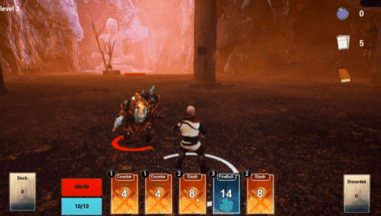
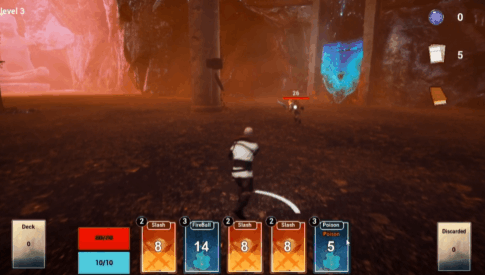
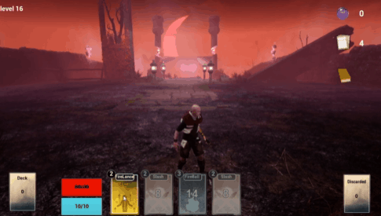
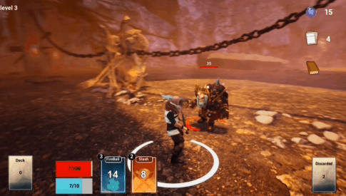
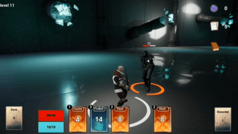
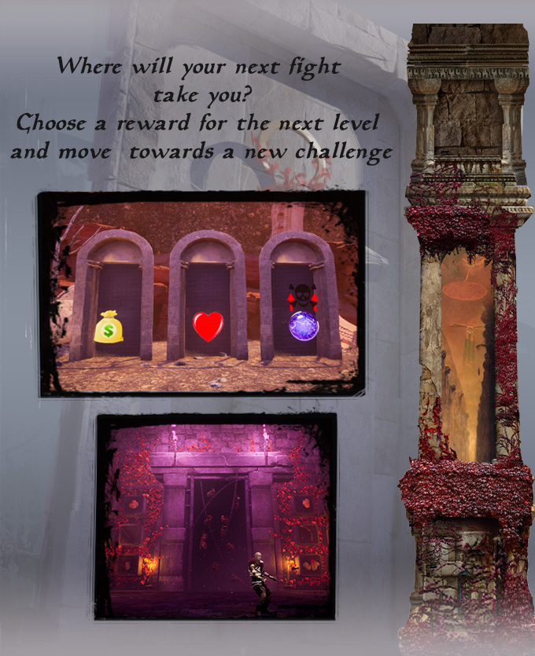

# **Magia Arcana Litepaper**

## **The Project**

## **Cards**

Drag and drop to use cards, but make sure you have enough Action Points (AP).

Each card is procedurally generated to give even more variety to the gameplay.

Evolving a card can have different effects: Increase damage output, decrease AP cost, adding Area Of Effect damage, or even adding a new status effect.

**Magic cards** can be very powerful but have a casting time that vary between cards.

**Buff cards** also have casting time

##  **Combat**

The character will automatically attack during its turn

Some cards with Stagger or Stun statuses can affect the enemy turn and even stop it midway through a powerful attack.

Combo cards for powerful special attacks!

Hundreds of combos available to discover, each with different results! experiment, adapt and create your own playstyle.

## **Level Progression**

Completing a level will reward you with a card plus a specific reward.

After a fight, doors to the next level will appear. Pick the one based on your strategy and risk appetite.

If you are low on health you might want to aim for a Health recovery reward, but you can also try to gain more souls, find shops, or if you are confident in your skills you can even pick a path with additional challenge but double rewards.

Every X amount of levels, you will encounter a Boss room, where you will find one or multiple incredibly strong enemies.

## **Blockchain & NFT**

A massive constantly-updating NFT based marketplace where you can buy and sell items.

All players get access to a starting deck when registering, there is no entry price to start playing.

## **Team and Release scope**

Our main objective is to reach a **much broader audience** than current blockchain based games.

- **Onboarding**: The current entry point for blockchain games is too complicated. We aim to build a much more straightforward onboarding that doesn't require the user to be experienced in blockchain and NFT technologies.

- **Multiple** **platforms**: The game is being developed for PC, but the team has experience developing on consoles and mobile platforms. We believe that to reach a broader audience we have to think much further than just the PC ecosystem.