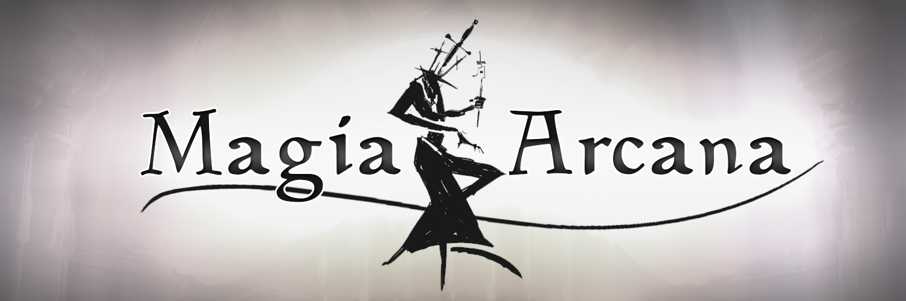
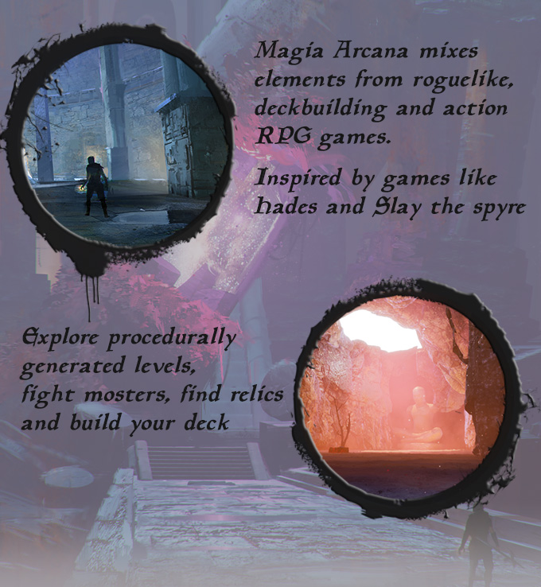
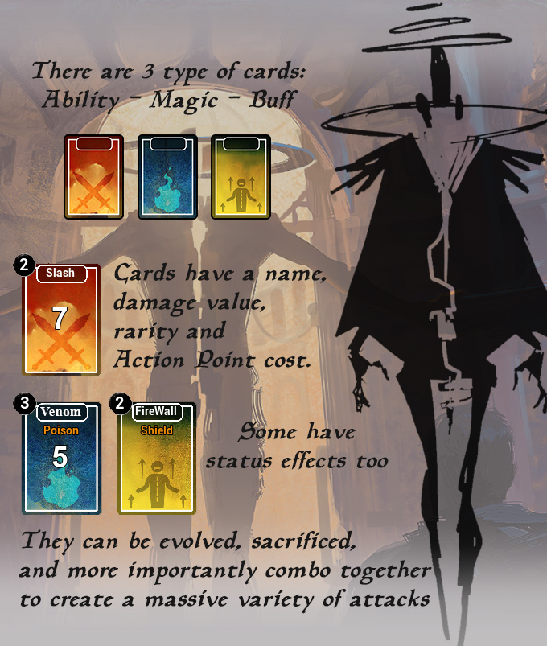
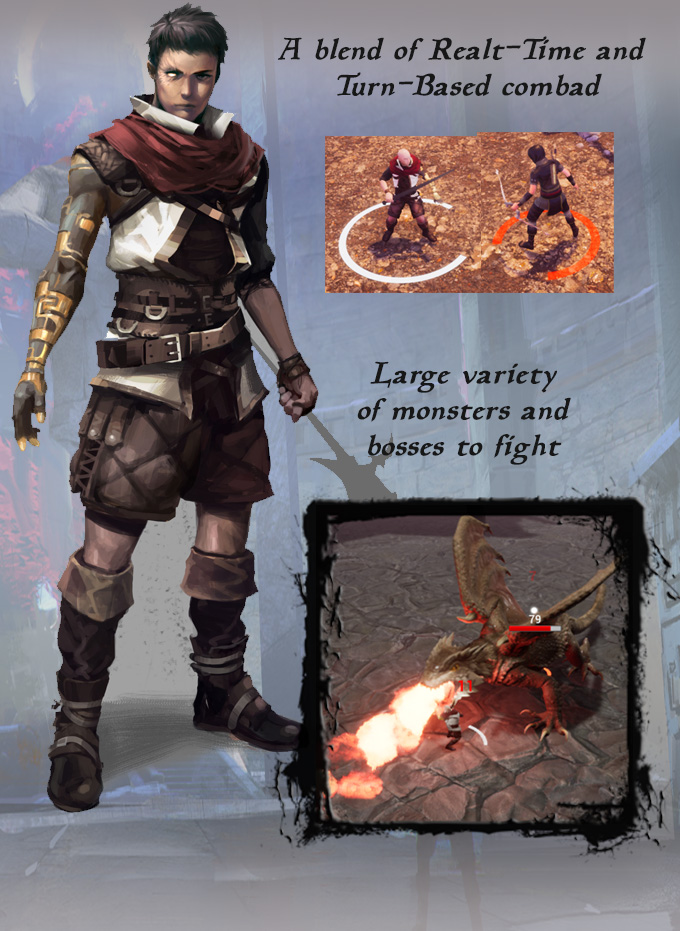
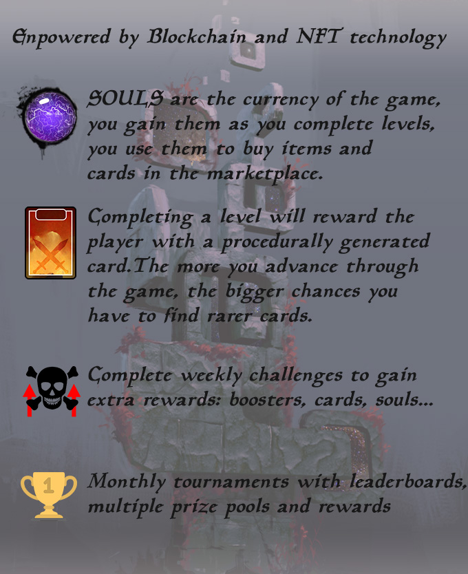

# Magia Arcana Litepaper

## The Project

## Cards

Drag and drop to use cards, but make sure you have enough Action Points (AP).

*nuovagif

Each card is procedurally generated to give even more variety to the gameplay.

Evolving a card can have different effects: Increase damage output, decrease AP cost, adding Area Of Effect damage, or even adding a new status effect.

Magic cards can be very powerful but have a casting time that vary between cards.

##  Combat

Automatically attack during your turn

*nuovagifstun

Some cards with Stagger or Stun statuses can affect the enemy turn

*nuovagifstun

Combo cards for powerful special attacks.

*nuovagif

Hundreds of combos available to discover, each with different results!

## Blockchain & NFT

